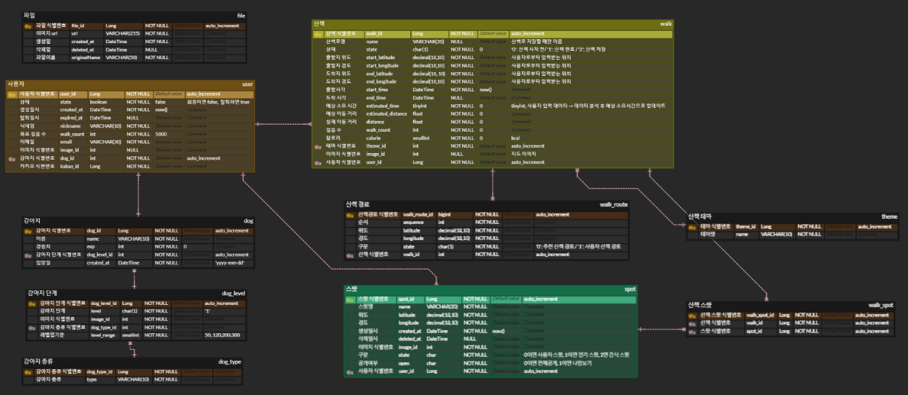

## 프로젝트 개요

다른 길로 산책을 수행하고 싶을 때 산책하기에 적합하지 않은 최적의 경로만을 판단하여 추천하기만 할 때

그날의 기분따라 다른 테마를 선택하여 다양한 산책 경로를 추천받고 싶을 때

## 목차

1. 프로젝트 기획 배경
2. 개발환경
3. 프로젝트 구조
4. 주요 기능
5. 서비스 화면

## 프로젝트 기획 배경

- 다양한 산책 코스 추천
  - 매일 산책을 즐기고 싶지만 같은 코스를 반복하는 산책에 지겨움을 느낄 때<br>
- 소요 시간에 맞춘 산책 코스
  - 30분만 걷고싶을 때<br>
- 테마에 따른 경로 추천
  - 조용하고 싶은날, 범죄 위험이 없는 곳, 자연을 느낄 수 있는 곳, 도심 속 산책길<br>

## 개발환경

Frontend

- React Native 2.0.1
- Typescript 5.2.2

Backend

- Java
  - Java OpenJDK 11
  - SpringBoot 2.7.15
    - Spring Web
    - Lombok
    - Spring Data JPA
    - Spring Security
    - Spring Boot DevTools
  - Gradle

Server

- Nginx 1.18.0
- Docker 24.0.6
- Docker Compose 1.25.0
- Jenkins 2.414.3

Database

- MySQL 5.7.35

IDE

- Visual Studio Code 1.78.2
- Android Studio
- IntelliJ IDEA 2023.1

형상 / 이슈 관리

- Gitlab
- Jira

## 프로젝트 구조

**시스템 아키텍처**

**ERD**

<br>

**Backend**

```
backend
│ src
    ├─main
      └─java
          └─com
              └─ssafy
                  └─B306
                      │  B306Application.java
                      │
                      └─domain
                          ├─exception
                          │      CustomException.java
                          │      ErrorCode.java
                          │      ErrorResponseDto.java
                          │      ExceptionManager.java
                          │      JwtExceptionResponse.java
                          │
                          ├─ImageUpload
                          │      ImageController.java
                          │      ImageUploadService.java
                          │
                          ├─OAuth
                          │      OAuthController.java
                          │      OAuthService.java
                          │
                          ├─quiz
                          │  │  Quiz.java
                          │  │  QuizController.java
                          │  │  QuizRepository.java
                          │  │  QuizService.java
                          │  │
                          │  └─dto
                          │          QuizRequestSaveDto.java
                          │          QuizResponseDto.java
                          │
                          ├─quizbook
                          │  │  QuizBook.java
                          │  │  QuizBookController.java
                          │  │  QuizBookRepository.java
                          │  │  QuizBookService.java
                          │  │
                          │  └─dto
                          │          QuizBookListResponseDto.java
                          │          QuizBookModifyRequestDto.java
                          │          QuizBookResponseDto.java
                          │          QuizBookSaveRequestDto.java
                          │
                          ├─s3
                          │      AwsSesConfig.java
                          │      S3Controller.java
                          │      S3Service.java
                          │
                          ├─security
                          │  │  JwtAuthenticationFilter.java
                          │  │  JwtAuthenticationProvider.java
                          │  │  JwtExceptionFilter.java
                          │  │  JwtToken.java
                          │  │  JwtUtil.java
                          │  │
                          │  └─config
                          │          CorsConfig.java
                          │          SecurityConfig.java
                          │
                          ├─template
                          │  │  Template.java
                          │  │  TemplateController.java
                          │  │  TemplateRepository.java
                          │  │  TemplateService.java
                          │  │
                          │  └─dto
                          │          TemplateResponseDto.java
                          │          TemplateSaveDto.java
                          │
                          └─user
                              │  RedisConfig.java
                              │  RedisUtil.java
                              │  User.java
                              │  UserController.java
                              │  UserRepository.java
                              │  UserService.java
                              │
                              └─dto
                                      EmailAuthRequestDto.java
                                      EmailRequestDto.java
                                      UserDto.java
                                      UserLoginRequestDto.java
                                      UserLoginResponseDto.java
                                      UserModifyRequestDto.java
                                      UserRegisterRequestDto.java
                                      UserSignUpResponseDto.java


```

**Frontend**

```
frontend
│  src
    │  App.css
    │  App.js
    │  App.test.js
    │  globalStyles.js
    │  index.css
    │  index.js
    │  logo.svg
    │  registerServiceWorker.js
    │  reportWebVitals.js
    │  setupTests.js
    │  user.js
    │
    ├─assets
    │  └─images
    │
    ├─components
    │  │  imageUploader.js
    │  │  secCounter.js
    │  │  VideoRoomComponent.css
    │  │  VideoRoomComponent.js
    │  │
    │  ├─api
    │  │      tokenHttp.js
    │  │
    │  ├─auth
    │  │      AuthForm.js
    │  │      AuthMail.js
    │  │      AuthTemplate.js
    │  │      Logout.js
    │  │      PhotoUpload.js
    │  │      RegisterForm.js
    │  │      UserInfo.js
    │  │
    │  ├─chat
    │  │      ChatComponent.css
    │  │      ChatComponent.js
    │  │
    │  ├─common
    │  │      Button.js
    │  │      CodedState.js
    │  │      Grid.js
    │  │      Image.js
    │  │      Input.js
    │  │
    │  ├─dialog-extension
    │  │      DialogExtension.css
    │  │      DialogExtension.js
    │  │
    │  ├─Fonts
    │  │      BMEULJIRO.otf
    │  │      BMEuljiro10yearslaterOTF.otf
    │  │      BMEuljirooraeoraeOTF.otf
    │  │      BMHANNAProOTF.otf
    │  │      Font.css
    │  │      JSArirang.otf
    │  │      PFstardust.ttf
    │  │
    │  ├─game
    │  │      Check.js
    │  │      CheckSafe copy.js
    │  │      CheckSafe 원본.js
    │  │      GameInvite.js
    │  │      QuizText.js
    │  │      Scoring.js
    │  │
    │  ├─stream
    │  │      OvVideo.js
    │  │      StreamComponent.css
    │  │      StreamComponent.js
    │  │
    │  └─toolbar
    │          ToolbarComponent.css
    │          ToolbarComponent.js
    │
    ├─layout
    │      openvidu-layout.js
    │
    ├─lib
    │  └─styles
    │          palette.js
    │
    ├─models
    │      user-model.js
    │
    ├─page
    │      GameCreate.js
    │      GameCreate.module.css
    │      LoginPage.js
    │      MainPage.js
    │      MyPage.js
    │      SignupPage.js
    │
    └─redux
        ├─config
        │      AuthMiddleware.js
        │      store.js
        │
        └─modules
                authSlice.js
                photoSlice.js
```

## 주요 기능

- 맞춤형 산책 경로 추천
  - 사용자가 입력한 출발지, 도착지, 소요 시간, 테마를 기반으로 산책 경로를 추천합니다.<br>
- 산책 기록 저장
  - 사용자의 산책 활동 데이터를 실시간으로 추적하고, 산책 종료 시 데이터를 보관합니다.
  - 추천된 산책 경로를 바탕으로 사용자가 수행한 산책 데이터를 저장합니다.<br>
- 경로 즐겨찾기(보관함)
  - 사용자가 선호하는 경로를 저장하여, 향후 해당 경로로 다시 산책할 수 있도록합니다.
  - 추천받은 산책 경로를 다음에 또 사용하고 싶다면 보관함에 저장할 수 있습니다.<br>
- 산책 메이트
  - 산책의 즐거움을 느낄 수 있도록 나만의 가상 강아지와 함께 산책을 수행합니다.<br>
- 강아지 키우기 (산책 경험치에 따라 레벨업)
  - 산책의 시간과 거리에 따라 강아지의 경험치가 증가하며, 일정 경험치를 달성하면 레벨업이 이루어집니다.<br>

## 서비스 화면

홈 화면

- 오늘 하루동안 쌓인 산책 걸음수, 이동거리, 칼로리를 확인할 수 있습니다.
- 산책 시작하기를 누르면 산책 경로 추천을 위한 설정 화면으로 이동합니다.
- 내가 키우는 강아지에 대한 정보를 확인할 수 있습니다.<br>

산책 설정

- 출발지와 도착지 위치, 테마, 소요시간을 설정하면 해당 데이터를 기반으로 산책 경로를 생성합니다.<br>

산책 경로 확인

- 추천 받은 산책 경로를 확인하고 산책을 시작할지, 종료할지 결정합니다.<br>

산책

- 추천된 산책 경로를 따라 산책을 수행합니다. 사용자의 실시간 위치를 지도에 띄워 현재 위치를 확인할 수 있습니다.<br>

마이페이지

- 월 별 산책 기록을 확인할 수 있습니다.
- 설정해둔 산책 목표를 달성했을 경우, 지도에 강아지 발바닥을 찍어 한 눈에 확인할 수 있습니다.<br>
