# 아는 개 산책

## 프로젝트 개요

<div align="center">
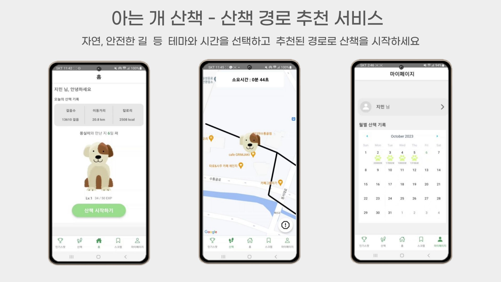<br>
</div>

📆 개발 기간 : 2023.10.09 ~ 2023.11.17

<br/>

## ✔️ 목차

1. [프로젝트 기획 배경](#-프로젝트-기획-배경)
2. [프로젝트 목표](#-프로젝트-목표)
3. [주요 기능](#-주요-기능)
4. [서비스 화면](#-서비스-화면)
5. [기술 차별점](#-기술-차별점)
6. [개발 환경](#-개발-환경)
7. [프로젝트 구조](#-프로젝트-구조)
8. [서비스 아키텍쳐](#-서비스-아키텍쳐)
9. [협업환경](#-협업환경)
10. [팀원](#-팀원)
11. [프로젝트 산출물](#-프로젝트-산출물)

<br/><br/>

## ✨ 프로젝트 기획 배경

- 다양한 산책 코스 추천
  - 매일 산책을 즐기고 싶지만 같은 코스를 반복하는 산책에 지겨움을 느낄 때
- 소요 시간에 맞춘 산책 코스
  - 30분만 걷고싶을 때
- 테마에 따른 경로 추천
  - 조용하고 싶은날, 범죄 위험이 없는 곳, 자연을 느낄 수 있는 곳, 도심 속 산책길

<br/><br/>

## ✨ 프로젝트 목표

- 산책 테마와 소요 시간을 반영하여 산책 경로를 추천해주는 서비스 제공
- 현위치 기반의 산책 수행과 산책 경로를 저장할 수 있는 서비스 제공

<br/><br/>

## 🌳 주요 기능

**맞춤형 산책 경로 추천**

- 사용자가 입력한 출발지, 도착지, 소요 시간, 테마를 기반으로 산책 경로를 추천합니다.

**산책 기록 저장**

- 사용자의 산책 활동 데이터를 실시간으로 추적하고, 산책 종료 시 데이터를 보관합니다.
- 추천된 산책 경로를 바탕으로 사용자가 수행한 산책 데이터를 저장합니다.

**경로 즐겨찾기(보관함)**

- 사용자가 선호하는 경로를 저장하여, 향후 해당 경로로 다시 산책할 수 있도록합니다.
- 추천받은 산책 경로를 다음에 또 사용하고 싶다면 보관함에 저장할 수 있습니다.

**산책 메이트**

- 산책의 즐거움을 느낄 수 있도록 나만의 가상 강아지와 함께 산책을 수행합니다.

**강아지 키우기 (산책 경험치에 따라 레벨업)**

- 산책의 시간과 거리에 따라 강아지의 경험치가 증가하며, 일정 경험치를 달성하면 레벨업이 이루어집니다.

<br/><br/>

## 🖥 서비스 화면

### 홈 화면

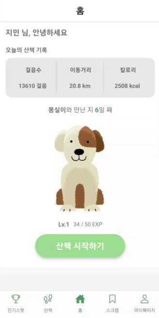

- 오늘 하루동안 쌓인 산책 걸음수, 이동거리, 칼로리를 확인할 수 있습니다.
- 산책 시작하기를 누르면 산책 경로 추천을 위한 설정 화면으로 이동합니다.
- 내가 키우는 강아지에 대한 정보를 확인할 수 있습니다.

### 산책 설정

<div style="display: flex; justify-content: space-between;">
    
    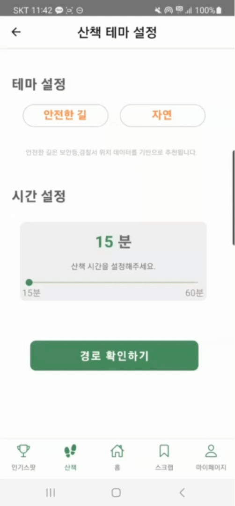
</div>
<br>

- 출발지와 도착지 위치, 테마, 소요시간을 설정하면 해당 데이터를 기반으로 산책 경로를 생성합니다.

### 산책 경로 확인

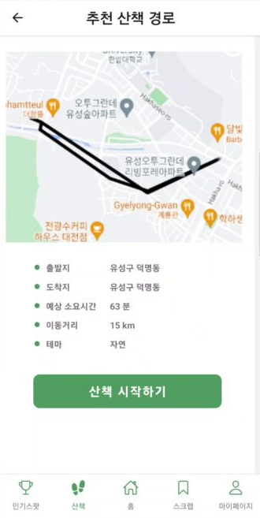

- 추천 받은 산책 경로를 확인하고 산책을 시작할지, 종료할지 결정합니다.

### 산책


- 추천된 산책 경로를 따라 산책을 수행합니다. 사용자의 실시간 위치를 지도에 띄워 현재 위치를 확인할 수 있습니다.

### 마이페이지

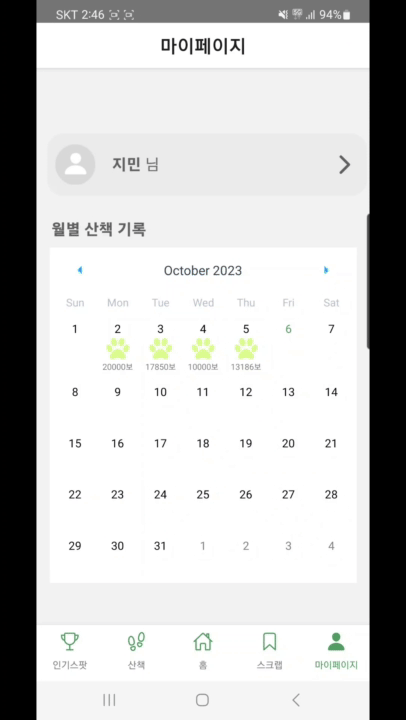

- 월 별 산책 기록을 확인할 수 있습니다.
- 설정해둔 산책 목표를 달성했을 경우, 지도에 강아지 발바닥을 찍어 한 눈에 확인할 수 있습니다.

<br/><br/>

## 📃 기술 차별점

### 빅데이터 전처리 및 분석을 통해 경로 간선 생성

- QGIS 데이터 분석 툴을 사용하여 데이터 전처리

  - 벡터 값으로 표현되는 인도 데이터를 정점으로 추출하여 데이터 분석에 활용
  - 하천 데이터 기준 버퍼 생성을 통해 하천 인근 인도 데이터를 추출하여 데이터 분석에 활용

- Jupyter + Spark를 활용하여 테마 별 경로 데이터 수집 및 처리 진행
  - [CCTV, 경찰서, 가로등 좌표 + 인도 데이터], [하천 데이터, 가로수 좌표 + 인도데이터]의 좌표를 이용하여 가중치를 반영한 경로 간선 데이터 생성
  - 산책 테마 멸 약 5천만개의 경로 가중치 간선을 생성

### 산책 경로 제공

- 다익스트라 알고리즘을 활용하여 산책 시간, 가중치, 위치를 반영한 산책 경로를 제공
  - 현재 위치를 기준으로 시간을 고려하여 반경을 설정하고, 해당 거리 내에 가장 가중치가 높은 산책 경로를 선별하여 제공

<br/><br/>

## 🔧 개발 환경

### Frontend

- React Native 2.0.1
- Typescript 5.2.2

### Backend

- Java
  - Java OpenJDK 11
  - SpringBoot 2.7.15
    - Spring Web
    - Lombok
    - Spring Data JPA
    - Spring Security
    - Spring Boot DevTools
  - Gradle

### Server

- Nginx 1.18.0
- Docker 24.0.6
- Docker Compose 1.25.0
- Jenkins 2.414.3

### Database

- MySQL 5.7.35

### IDE

- Visual Studio Code 1.78.2
- Android Studio
- IntelliJ IDEA 2023.1

### 형상 / 이슈 관리

- Gitlab
- Jira

<br/><br/>

## 🔨 프로젝트 구조

### Backend (Spring Boot)

```
│  .gitignore
│  build.gradle
│  Dockerfile
│  gradlew
│  gradlew.bat
│  Jenkinsfile
│  settings.gradle
│
├─.idea
│      .gitignore
│      gradle.xml
│      misc.xml
│      vcs.xml
│
├─gradle
│  └─wrapper
│          gradle-wrapper.jar
│          gradle-wrapper.properties
│
└─src
    ├─main
      └─java
          └─io
              └─ssafy
                  └─p
                      └─j9b304
                          └─backend
                              │  BackendApplication.java
                              │
                              ├─config
                              │      OpenApiConfig.java
                              │
                              ├─domain
                              │  ├─dog
                              │  │  ├─controller
                              │  │  │      DogController.java
                              │  │  │
                              │  │  ├─dto
                              │  │  │      DogGetResponseDto.java
                              │  │  │      DogModifyRequestDto.java
                              │  │  │
                              │  │  ├─entity
                              │  │  │      Dog.java
                              │  │  │      DogLevel.java
                              │  │  │      DogType.java
                              │  │  │
                              │  │  ├─repository
                              │  │  │      DogLevelRepository.java
                              │  │  │      DogRepository.java
                              │  │  │
                              │  │  └─service
                              │  │          DogService.java
                              │  │
                              │  ├─security
                              │  │  ├─config
                              │  │  │      CorsConfig.java
                              │  │  │      SecurityConfig.java
                              │  │  │
                              │  │  ├─jwt
                              │  │  │      JwtAuthenticationFilter.java
                              │  │  │      JwtToken.java
                              │  │  │      JwtTokenProvider.java
                              │  │  │
                              │  │  └─oAuth
                              │  │          KakaoProfile.java
                              │  │          OauthToken.java
                              │  │
                              │  ├─spot
                              │  │  ├─controller
                              │  │  │      SpotController.java
                              │  │  │
                              │  │  ├─dto
                              │  │  │      AddRequestDto.java
                              │  │  │      GetHotSpotResponseDto.java
                              │  │  │      GetResponseDto.java
                              │  │  │      ModifyRequestDto.java
                              │  │  │
                              │  │  ├─entity
                              │  │  │      Spot.java
                              │  │  │
                              │  │  ├─repository
                              │  │  │      SpotRepository.java
                              │  │  │
                              │  │  └─service
                              │  │          SpotService.java
                              │  │
                              │  ├─user
                              │  │  ├─controller
                              │  │  │      UserController.java
                              │  │  │
                              │  │  ├─dto
                              │  │  │  ├─request
                              │  │  │  │      UserModifyRequestDto.java
                              │  │  │  │
                              │  │  │  └─response
                              │  │  │          UserGetDetailResponseDto.java
                              │  │  │          UserGetWalkDetailResponseDto.java
                              │  │  │          UserGetWalkListResponseDto.java
                              │  │  │
                              │  │  ├─entity
                              │  │  │      User.java
                              │  │  │
                              │  │  ├─repository
                              │  │  │      UserRepository.java
                              │  │  │
                              │  │  └─service
                              │  │          UserService.java
                              │  │
                              │  └─walk
                              │      ├─controller
                              │      │      WalkController.java
                              │      │
                              │      ├─dto
                              │      │  ├─request
                              │      │  │      DijkstraResult.java
                              │      │  │      Edge.java
                              │      │  │      PathResult.java
                              │      │  │      Point.java
                              │      │  │      RouteAddRequestDto.java
                              │      │  │      WalkAddRequestDto.java
                              │      │  │      WalkExistPathAddRequestDto.java
                              │      │  │      WalkModifyRequestDto.java
                              │      │  │      WalkSaveRequestDto.java
                              │      │  │
                              │      │  └─response
                              │      │          RouteGetResponseDto.java
                              │      │          WalkGetDetailResponseDto.java
                              │      │          WalkGetListResponseDto.java
                              │      │          WalkGetTodayResponseDto.java
                              │      │          WalkInitialInfoResponseDto.java
                              │      │          WalkSaveResponseDto.java
                              │      │
                              │      ├─entity
                              │      │      Path.java
                              │      │      Route.java
                              │      │      Theme.java
                              │      │      Walk.java
                              │      │      WalkSpot.java
                              │      │
                              │      ├─repository
                              │      │      RouteRepository.java
                              │      │      SafePathRepository.java
                              │      │      ThemeRepository.java
                              │      │      WalkRepository.java
                              │      │      WalkSpotRepository.java
                              │      │
                              │      └─service
                              │              RouteService.java
                              │              WalkService.java
                              │
                              └─global
                                  ├─config
                                  │      OpenApiConfig.java
                                  │      S3Config.java
                                  │
                                  ├─controller
                                  │      FileController.java
                                  │
                                  ├─entity
                                  │      File.java
                                  │
                                  ├─repository
                                  │      FileRepository.java
                                  │
                                  └─service
                                          FileService.java
                                          S3Service.java


```

### Frontend (React Native)

```
│  .eslintrc.js
│  .gitignore
│  .prettierrc
│  .prettierrc.js
│  .watchmanconfig
│  app.json
│  App.tsx
│  AppInner.tsx
│  babel.config.js
│  Gemfile
│  index.js
│  jest.config.js
│  metro.config.js
│  package-lock.json
│  package.json
│  README.md
│  tsconfig.json
│  yarn.lock
├─.bundle
│      config
├─.vscode
│      settings.json
├─android
│  │  build.gradle
│  │  Dockerfile
│  │  gradle.properties
│  │  gradlew
│  │  gradlew.bat
│  │  Jenkinsfile
│  │  settings.gradle
│
├─ios
│  │  .xcode.env
│  │  Podfile
│  │
│  ├─front
│  │  │  AppDelegate.h
│  │  │  AppDelegate.mm
│  │  │  Info.plist
│  │  │  LaunchScreen.storyboard
│  │  │  main.m
│  │  │
│  │  └─Images.xcassets
│  │      │  Contents.json
│  │      │
│  │      └─AppIcon.appiconset
│  │              Contents.json
│  │
│  ├─front.xcodeproj
│  │  │  project.pbxproj
│  │  │
│  │  └─xcshareddata
│  │      └─xcschemes
│  │              front.xcscheme
│  │
│  └─frontTests
│          frontTests.m
│          Info.plist
└─src
  ├─assets
  │      dogFace.png
  │      dog_body.png
  │      kakao_login_button.png
  │      main_background.png
  │      route.png
  │      stopmap.png
  │      walk.png
  │      walkroute.png
  │
  ├─components
  │      DismissKeyboardView.tsx
  │      react-native-keyboard-aware-scrollview.d.ts
  │
  ├─redux
  │  │  reducer.ts
  │  │  store.ts
  │  │
  │  ├─action
  │  │      walkAction.ts
  │  │
  │  └─reducer
  │          userSlice.ts
  │          walkReducer.ts
  │
  └─screens
      ├─home
      │      HomeMain.tsx
      │      HomeScreen.tsx
      │
      ├─loginStart
      │      LoginScreen.tsx
      │
      ├─myPage
      │  │  MyPage.tsx
      │  │  MyPageDetail.tsx
      │  │  MypageMain.tsx
      │  │  ProfileEdit.tsx
      │  │
      │  └─assets
      │          image-user.png
      │          modify-user.png
      │          walkroute.png
      │
      ├─popularSpot
      │      PopularSpot.tsx
      │
      ├─scrap
      │      RouteDetail.tsx
      │      ScrapMain.tsx
      │      WalkingSavedScreen.tsx
      │
      └─walking
              NewWalkingSetting.tsx
              SavedWalkingSetting.tsx
              SpotSavedScreen.tsx
              StartDesMap.tsx
              TimeThemeSetting.tsx
              WalkingMain.tsx
              WalkingMap.tsx
              WalkingSetting.tsx


```

<br/><br/>

## 🚧 서비스 아키텍쳐

<div align="center">
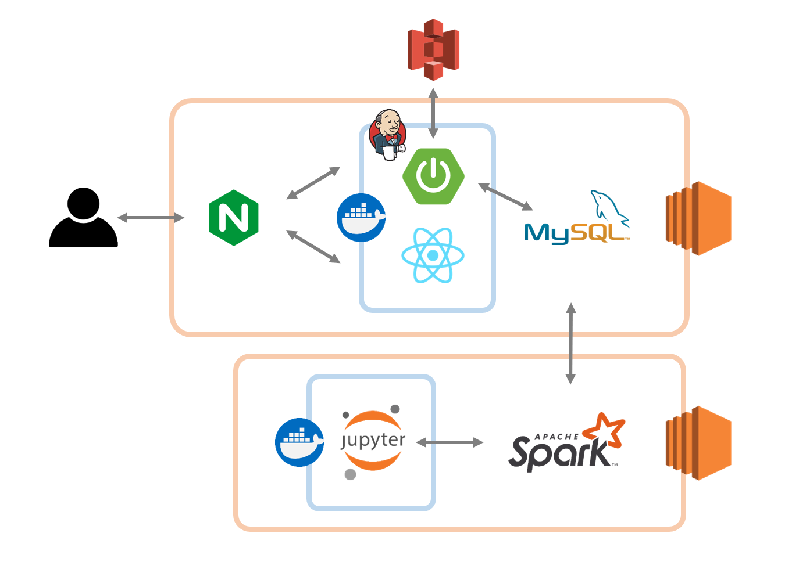<br>
</div>
<br/>

## 👪 협업환경

### Git으로 협업하기

**Git 브랜치 전략**

```
- master (운영용)
    - develop (통합 테스트용)
        - frontend
            - feature-frontend/기능명
        - backend
            - feature-backend/기능명
```

브랜치는 master, develop, frontend, backend, feature를 사용했으며 전략은 다음과 같습니다.

- `master`: 서비스가 배포될 수 있는 브랜치입니다. master 브랜치에 올라온 기능들은 에러 없이 작동하는 상태입니다.

- `develop`: master 브랜치에 올라가기전 frontend와 backend의 통합 테스트를 위한 브랜치입니다.

- `frontend`, `backend` : 기능 개발이 완료된 브랜치를 병합하여 각 fontend와 backend 환경에서 실제 기능이 정상적으로 수행되는지 테스트를 위한 브랜치 입니다.

- `feature`: 기능 단위 개발을 위한 브랜치로 frontend/backend에서 분기하여 개발이 끝나면 각각 베이스 브랜치로 병합됩니다.

<br/>

**Git 컨벤션**

- 푸시는 모든 기능을 한 번에 하는게 아닌 작은 기능별로 잘게잘게 나눠서 커밋 후 큰 틀이 완성되면 푸시하기
- 커밋메세지 양식 : `[type]: subject`
- Merge Request 양식
  - [ ] 커밋 메시지 컨벤션에 맞게 작성했습니다.
  - [ ] 버그수정 혹은 기능에 대한 테스트를 진행했습니다.
  - [ ] 병합 대상 브랜치를 올바르게 설정하였습니다.`

<br/>

### Jira로 협업하기

매주 월요일 스프린트 회의를 통해 그 주의 목표를 세우고 목표 달성을 위한 구체적인 작업들을 정리했습니다.팀 회의와 같은 공통적인 일정부터 파트별 회의, 개인 개발 작업까지 구체적으로 계획했습니다. 스크럼미팅을 통해 오늘의 목표와 주의 목표를 달성하기 위한 진척사항을 공유하였습니다.

`에픽`: 어떤 작업이 속하는 레벨로 공통(설계, 회의), 데이터분석, 백엔드, 프론트 총 4가지 에픽을 만들어 사용하였습니다.

`스토리`: 에픽에 속하는 작업의 단위입니다. 구체적인 작업 내용을 작성하고 스토리 포인트로 예상 소요 시간을 산정할 수 있습니다. 파트별 미팅을 통해 주간 목표에 맞는 구체적인 작업 내용을 스토리로 생성하였습니다.

`번다운 차트`: 스프린트의 목표를 달성하기 위해 남은 시간과 남은 스토리 포인트를 확인해 프로젝트의 진척도를 파악하였습니다.

<br/><br/>

## 🙆 팀원

| [안도희](https://github.com/doheeahn) | [이효경](https://github.com/HyoKyoung1004) | [이서연](https://github.com/sylee723) | [홍지민](https://github.com/ZIM-H) | [안준영](https://github.com/Yangjunyeong) |
| :-----------------------------------: | :----------------------------------------: | :-----------------------------------: | :--------------------------------: | :---------------------------------------: |
|         |              |         |      |             |
|              데이터 분석              |                데이터 분석                 |           BackEnd<br>Infra            |              BackEnd               |                 FrontEnd                  |

<br/><br/>

## 👀 프로젝트 산출물

### 요구사항 정의서

<div align="center">
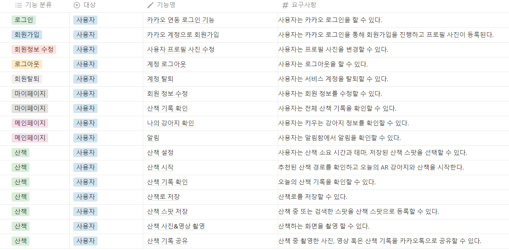<br>
</div>
<br/>

### API 명세서

<div align="center">
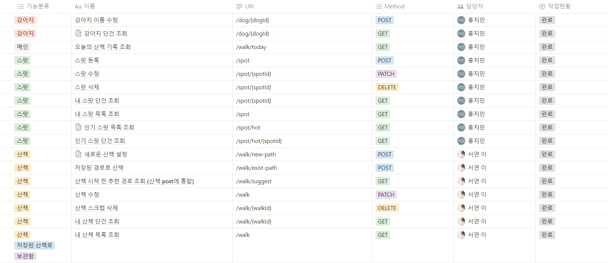<br>
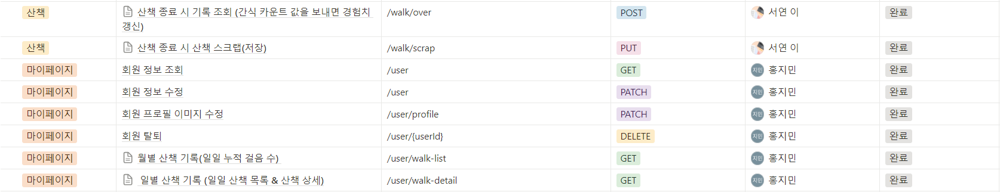<br>
</div>
<br/>

### ERD

<div align="center">
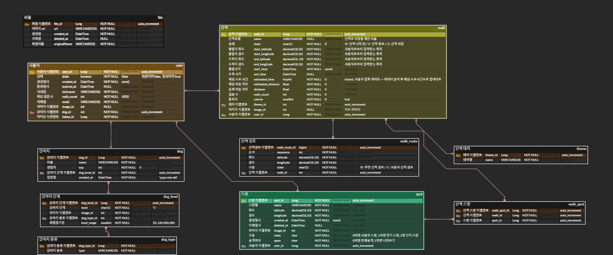<br>
</div>
<br/>

### 와이어프레임

<div align="center">
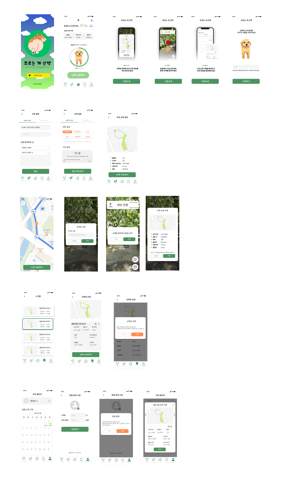<br>
</div>
<br/>

### 프로젝트 발표자료

- [최종발표 Presentation](data/특화 최종 발표 자료.pdf)
